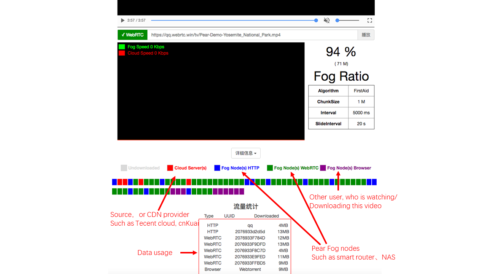

<h1 align="center">
  </img>
  <br>
  <a href="https://demo.webrtc.win/player">PearPlayer.js</a>
  <br>
  <br>
</h1>

<h4 align="center">The streaming media player for multi-protocol, multi-source and mixed P2P-CDN</h4>
<p align="center">
  <a href="https://www.npmjs.com/package/pearplayer"></a>
   <a href="https://www.jsdelivr.com/package/npm/pearplayer"></a>
 <a href="https://www.jsdelivr.com/package/npm/pearplayer"></a>
</p>
<br>

**[English](https://github.com/PearInc/PearPlayer.js/blob/master/README_EN.md)**

PearPlayer（梨享播放器）**[[Demo](https://demo.webrtc.win/)]**  is a streaming media player framework written completely with HTML5 and JavaScript. The player implements multiprotocols , multisources , low latency and high bandwidth of no plugin in webside . The player support HTTP protocol (including HTTPS, HTTP2) and WebRTC protocol . Why can PearPlayer guarantee the maximum P2P ratio and user's fluent video experience ?  Firstly , H5 MSE ( Media Source Extension) technology can collect the Buffer block from multiple source nodes to the player. Secondly, the well-designed algorithm is to achieve the best scheduling mechanism and configure to failover automatically.


<br>
<br>


You can use PearPlayer only by importing `pear-player.min.js` through the  `<script>` script tag to HTML. Refer to the following [code examples](#快速开始)，or [`/examples/player-test.html`](/examples/player-test.html) can help you. Get reference [get-started](docs/get-started.md) below to understand the basic usage .<br/>  


## Feature
- It can be used without plugins, extensions, or installations because of P2P ability for WebRTC
- Multiprotocols (HTTP, HTTPS, WebRTC) and multisources
-	Scheduling algorithm can ensure the users smooth video experience under maximizing P2P ratio 
-	no parameter( the system can adapt by itself bases on the video bit rate ). Even the player can adjust algorithms and parameters by itself on advanced usage patterns
-	No unlimited buffers to save bandwidth / traffic for CP users
-	Support Chrome, Firefox, Opera, IE, Edge and other mainstream browsers. Besides, and will support Safari, Tencent WeChat and X5/TBS( multi-source transmission ; the playing issues can be well resolved by MSE.) 
-	access to low cost, high availability Pear Fog CDN
-	The protocols are fully encrypted by TLS/DTLS with no DPI feature; eliminate statistical characteristics via Pear Fog dynamic port
-	As easy as using HTML5 <video> script tag and easy to integrate with popular player fameworks such as video.js
- The ability of browser P2P（base on WebTorrent）




## Quick Start
It's time to witness a migic - please copy the following code into Web HTML5 code, and then open a webpage .

```html
<script src="https://cdn.jsdelivr.net/npm/pearplayer@latest"></script>
<video id="video" controls></video>
<script>
  var player = new PearPlayer('#video', { src: 'https://qq.webrtc.win/tv/Pear-Demo-Yosemite_National_Park.mp4' });
</script>
```

## ## Using Method 

###  Simply include the video label on the js packet
And then import the <script> script tag to pear-player.min.js：
```html
<script src="./dist/pear-player.min.js"></script>
```
or use CDN：
```html
<script src="https://cdn.jsdelivr.net/npm/pearplayer@latest"></script>
```
Suppose we want to use video script tag  to paly the fllowing video, see HTML below：
```html
<video id="pearvideo" src="https://qq.webrtc.win/tv/Pear-Demo-Yosemite_National_Park.mp4" controls>
```
Import PearPlayer to the video script tag  , using the codes below:
```html
<script>
  /**
  * The first parameter is ID or CLASS of the video label
  * Opts, the optional parameter configuration
  */
  if (PearPlayer.isMSESupported()) {
    var player = new PearPlayer('#pearvideo', opts);
  }
</script>
```
Congratulations! NOW your player has the P2P ability and no plugin!

### How to speed up the videos？
The videos above  is already distributed into Pear’s massive nodes . So how to speed up any other video?  Add your video's URL into[Video distribution system](https://oss.webrtc.win/). And now you can use Pear's massive odes to speed up your videos！Please click [here](https://manual.webrtc.win/oss/)（only support  `MP4`format，and add `Pear-Demo` in front of the video's name ,such as `Pear-Demo-movie.mp4`）

## Who is using Pear Player today？

+ [Pear Limited](https://pear.hk)
+ [Lenovo China](https://www.lenovo.com.cn/)
+ [Newifi xCloud](http://www.newifi.com/)
+ [FastWeb](http://fastweb.com.cn/)
+ [UCloud](https://www.ucloud.cn)
+ [Tencent Cloud](https://qcloud.com)
+ [Tencent X5/TBS](https://x5.tencent.com/tbs/)
+ [Tencent APD](http://www.chinaz.com/news/2016/0707/548873.shtml)

## Pear Player document
- **[get-started ](docs/get-started.md)**
- **[API](docs/api.md)**

## Thanks
Special thanks to the following projects to provide some source of inspiration and API design reference for our project:

- [WebTorrent](https://github.com/webtorrent/webtorrent)
- [Peer5](https://www.peer5.com/#)

## Speech and media coverage

- Nov 2017（Gold Science and Technology） - [DITING Technologies Inc，which invested Pear Limited， has entered Blockchain domain ](http://www.jinse.com/blockchain/99767.html)
- Sep 2017 Future Network and Open Community Alliance） - [Fog Computing has begun after Cloud Computing ——about P2P CDN](https://mp.weixin.qq.com/s/39dfSA6cTj2eoo-KqsC3AQ)  
- Aug 2017（IT biggie talk） - [Will WebRTC be the mainstream？It's era to crowdsource ！](http://mp.weixin.qq.com/s/cx_ljl2sexE0XkgliZfnmQ)
- Jul 2017（OSChina） - [PearPlayer.js —— The streaming media player is Mixed P2P-CDN](https://www.oschina.net/p/PearPlayerjs)
- Jun 2017（Tencent Frontend Conference） - [P2P-CDN streaming media acceleration based on WebRTC](http://www.itdks.com/dakalive/detail/2577)
- May 2017（Southern University of Science and Technology） - Edge Computing and Shared Fog Streaming
- May 2017（Feng Chia University） - A Cooler Fruit Venture: Scaling up a Network from Cloud to Fog with Crowdsourcing
- Aug 2016（Hong Kong University of Science and Technology） - From Cloud to Fog: Scaling up a Network with Crowdsourcing

## License

MIT. Copyright (c) [Pear Limited](https://pear.hk) and [snowinszu](https://github.com/snowinszu).

## Service
E-mail: <service@pear.hk>；QQ group ：`373594967`； [CP/CDN、OEM and other business ] (https://github.com/PearInc/FogVDN)
