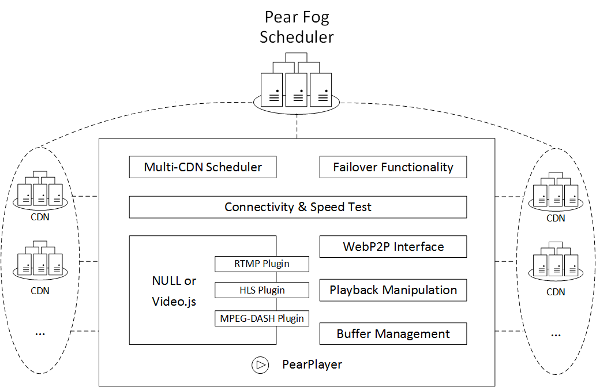
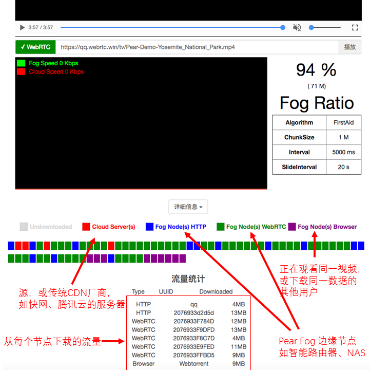

<h1 align="center">
  </img>
  <br>
  <a href="https://demo.webrtc.win/player">PearPlayer.js</a>
  <br>
  <br>
</h1>

<h4 align="center">A streaming media player that supports multi-protocol, multi-source and mixed P2P-CDN</h4>
<p align="center">
  <a href="https://www.npmjs.com/package/pearplayer"></a>
   <a href="https://www.jsdelivr.com/package/npm/pearplayer"></a>
 <a href="https://www.jsdelivr.com/package/npm/pearplayer"></a>
</p>
<br>

**[English](https://github.com/PearInc/PearPlayer.js/blob/master/README_EN.md)**

PearPlayer（梨享播放器）**[[Demo](https://demo.webrtc.win/)]** is an open source HTML5 streaming media player framework written completely in JavaScript,which fused HTTP (including HTTPS, HTTP2) and WebRTCwhich would be multi-protocol, multi-source, low latency, high bandwidth utilization, used end streaming media acceleration. MSE (Media Source Extension) based on H5 technology, collects the Buffer block from multiple source nodes to the player. With a well designed algorithm, PearPlayer can guarantee the maximum rate of P2P as well as smooth video experience. 


<br>
<br>


Through the html label`<script>`,you can import`pear-player.min.js` to html web。Refer to the following [code examples](#快速开始)，also[`/examples/player-test.html`](/examples/player-test.html)can help you.
Reffer to the[get-started](docs/get-started.md),you can get the basic method。<br/>

## Feature
- P2P ability is based on WebRTC, without installing any plugins
- Multi-protocol(HTTP, HTTPS, WebRTC)and multi-source
- Self scheduling algorithm research  that maximizes the P2P rate on ensuring the user's fluent video experience
- no parameter( system adaptability bases on the video bitrate ),adjust the algorithm and parameter by itself on the high usage patterns 
- No unlimited buffers to save bandwidth / traffic for CP users as much as possible
- Support Chrome, Firefox, Opera, IE, Edge and other mainstream browsers, it will support Safari, Tencent WeChat and X5/TBS.
- Optional access to low cost, high availability Pear [Fog CDN](https://github.com/PearInc/FogVDN)
- Protocol by TLS/DTLS, no DPI features; eliminate statistical characteristics through Pear Fog dynamic port
- like using HTML5 <video> label, easy to integrate with popular player framework such as [video.js](https://github.com/videojs/video.js)
- The ability of browser P2P（base on WebTorrent）




## Quick Start
Copy the following code into the HTML5 code, open a web page to witness a miracle time!

```html
<script src="https://cdn.jsdelivr.net/npm/pearplayer@latest"></script>
<video id="video" controls></video>
<script>
  var player = new PearPlayer('#video', { src: 'https://qq.webrtc.win/tv/Pear-Demo-Yosemite_National_Park.mp4' });
</script>
```

## ## method of use

### Import the js packet and bing the video label
use script label to import pear-player.min.js：
```html
<script src="./dist/pear-player.min.js"></script>
```
or use CDN：
```html
<script src="https://cdn.jsdelivr.net/npm/pearplayer@latest"></script>
```
suppose we want to use video label to paly the fllowing video,HTML as shown below：
```html
<video id="pearvideo" src="https://qq.webrtc.win/tv/Pear-Demo-Yosemite_National_Park.mp4" controls>
```
Only a few lines of code are required to bind the PearPlayer to the video label:
```html
<script>
  /**
  * 第一个参数为video标签的id或class
  * opts是可选的参数配置
  */
  if (PearPlayer.isMSESupported()) {
    var player = new PearPlayer('#pearvideo', opts);
  }
</script>
```
Congratulations! Your player has P2P capabilities and no plug-ins!

### How to speed up the video？
Video above is already distributed, so how to speed up any video? Only need to add your video URL into [Video distribution system](https://oss.webrtc.win/)，now you can use Pear's massive nodes to speed up your video！Please click [here](https://manual.webrtc.win/oss/)（only support  `MP4`format，and add `Pear-Demo`prefix of the video's name ,such as `Pear-Demo-movie.mp4`）

## Who is using Pear Player？

+ [Pear Limited](https://pear.hk)
+ [Lenovo China](https://www.lenovo.com.cn/)
+ [Newifi xCloud](http://www.newifi.com/)
+ [FastWeb](http://fastweb.com.cn/)
+ [UCloud](https://www.ucloud.cn)
+ [Tencent Cloud](https://qcloud.com)
+ [Tencent X5/TBS](https://x5.tencent.com/tbs/)
+ [Tencent APD](http://www.chinaz.com/news/2016/0707/548873.shtml)

## Pear Player document
- **[get-started ](docs/get-started.md)**
- **[API](docs/api.md)**

## Thanks
Special thanks to the following projects to provide some source of inspiration and API design reference for our project:

- [WebTorrent](https://github.com/webtorrent/webtorrent)
- [Peer5](https://www.peer5.com/#)

## Speech and media coverage

- 2017.11.24 （金色科技） - [谛听科技正式进军区块链领域，战略投资梨享计算](http://www.jinse.com/blockchain/99767.html)
- 2017.09.01 （未来网络开放社区联盟） - [继云计算之后，雾计算再起 —— 谈谈 P2P CDN](https://mp.weixin.qq.com/s/39dfSA6cTj2eoo-KqsC3AQ)  
- 2017.08.18 （IT大咖说） - [WebRTC会成主流吗？众包CDN时代到了！](http://mp.weixin.qq.com/s/cx_ljl2sexE0XkgliZfnmQ)
- 2017.07.11 （OSChina开源中国） - [PearPlayer.js —— 混合P2P-CDN的流媒体播放器](https://www.oschina.net/p/PearPlayerjs)
- 2017.06.24 （腾讯Web前端大会） - [基于WebRTC的P2P-CDN流媒体加速](http://www.itdks.com/dakalive/detail/2577)
- 2017.05.17 （南方科技大学） - Edge Computing and Shared Fog Streaming
- 2017.05.08 （台湾逢甲大学） - A Cooler Fruit Venture: Scaling up a Network from Cloud to Fog with Crowdsourcing
- 2016.08.17 （香港科技大学） - From Cloud to Fog: Scaling up a Network with Crowdsourcing

## License

MIT. Copyright (c) [Pear Limited](https://pear.hk) and [snowinszu](https://github.com/snowinszu).

## Service
E-mail: <service@pear.hk>；QQ group ：`373594967`； [CP/CDN、OEM and other business ] (https://github.com/PearInc/FogVDN)
